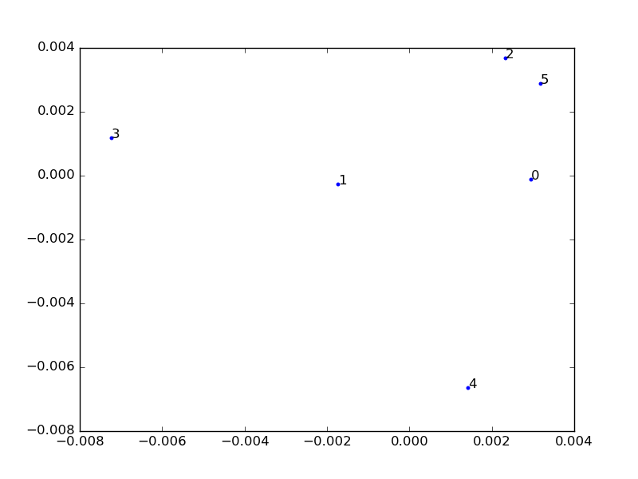

wiki\_relevance.py
-------

##概要
２つのwikipediaのページの関連度を計算します。  
声優同士の関連度の計算が目的。  
声優以外のワードでも可能?  
実行する関数の引数を指定することで、wikipediaのページのすべてのリンクを抽出するか、  
出演作品(アニメ)に限定し抽出するかを指定できます。  

##実行

```
$python3 wiki_relevance.py "声優1" "声優2"
```

声優を2人入力すると、それぞれの関連度を求めます。

##note

 - 手法としては、それぞれのページのリンクとなっている言葉を抽出、２つのページ間で一致するリンクワードから関連度を調べます。
 - 一致度としてJaccard係数を用いています。他の方法のほうが良いかも。
 - 単純に同じワードが多いほうが関連度は大きくなります。
 
 - 単語ごとに重みをつけたほうが良いかも。
 - ~~あと、ページ間で最短何リンクでたどり着けるかを考慮したほうが良いかも。~~  
 最短リンク数は声優を2つページを声優と仮定しているので1、2くらいにはなるはずなので、これはとりあえず無視。  
 - いろいろ先行研究があるのでそれを加えてみる。  
 - そのままでは関連度の値が小さいので規格化したほうが良いかも。  
 - wikipediaからアニメ作品の情報を持ってくるプログラムからキャストを取ってきて、  
 このプログラムに渡し、解析まで自動化したい。  
 →MDSまでは自動化完了
  
   
##実行結果(追加)

```
$ python3 wiki_relevance.py "悠木碧" "斎藤千和"  
1.166830897936477  
   
$ python3 wiki_relevance.py "悠木碧" "悠木碧"  
0.0  
  
$ python3 wiki_relevance.py "悠木碧" "喜多村英梨"  
1.091308325848836  
  
$ python3 wiki_relevance.py "悠木碧" "水橋かおり"  
1.3140325399303059  
  
$ python3 wiki_relevance.py "杉田智和" "中村悠一"  
0.9877815541443403  
  
$ python3 wiki_relevance.py "茅野愛衣" "島本須美"  
1.9128498242810998  
```

 - 類似度の値が小さかったので対数変換しました。  
 - 類似度の逆数を対数変換してます。  
 - 声優同士が似ているほど小さく、似ていないほど大きな値となります。  
完全一致で0となります。   


mds.py
-------

##概要
声優同士の関連度を多次元尺度構成法(MDS)を用いて  
グラフを描写します。  
wiki_relevance.pyの結果を用いています。  
  
  
##モジュール
- make\_matrix.py
MDSに必要な行列を計算します。  
- wiki\_relevance.py
声優同士の距離を求めます。  

##実行例
make\_matrix.pyに関連度を計算したい声優を渡す。  
(とりあえずプログラムに直接書き込む方法)  
今回は以下の声優を与える。  
["悠木碧","斎藤千和","喜多村英梨","水橋かおり","野中藍","加藤英美里"]

##実行  

```
$python3 mds.py
```

##結果
結果表示のあと、./figure ディレクトリにグラフが生成される  



 - 声優間の距離が近い声優ほど近くに配置されます。  
 - プロットされたそれぞれの点の位置関係を見るものなので、  
縦軸、横軸は気にしないでください。  

 - グラフのラベルは、与えた声優の順番に対応してます。  
今回は、["悠木碧","斎藤千和","喜多村英梨","水橋かおり","野中藍","加藤英美里"]を与えたので、  
悠木碧=0, 斎藤千和=1, 喜多村英梨=2, ..... ,  
となります。  
 - ちょっと数が少ないので、もう少し与える声優の数を増やしてみます。
 - pythonの遅さが目立ってきた....
  
  
  
  
##結果(追加)
 - twitterフォロワー上位50人を与えて見ました(少し省いてる人もいます)。  
 - 与えたデータはcv_list.datに記述してます。  
 - 以下のデータを与えてます。(見やすいように数字を振ってます)  
 0:杉田智和', '1:中村悠一', '2:諏訪部順一', '3:南條愛乃', '4:田村ゆかり', '5:谷山紀章', '6:小野賢章', '7:三森すずこ',   
 '8:井上麻里奈', '9:竹達彩奈', '10:安元洋貴', '11:森久保祥太郎', '12:江口拓也', '13浪川大輔', '14:木村良平', '15:島崎信長',  
'16:代永翼', '17:内田彩', '18:平野綾', '19:新田恵海', '20:上坂すみれ', '21:徳井青空', '22:大塚明夫', '23:楠田亜衣奈',  
'24:小野友樹', '25:喜多村英梨', '26:加藤英美里', '27:関智一', '28:蒼井翔太', '29:梶裕貴', '30:植田佳奈', '31:今井麻美',  
'32:保志総一朗', '33:花江夏樹', '34:田中理恵 (声優)', '35:緒方恵美', '36:小松未可子', '37:津田健次郎', '38:佐藤利奈',  
'39:山寺宏一', '40:置鮎龍太郎', '41:下田麻美', '42:吉野裕行', '43:中田譲治', '44:山口勝平', '45:福圓美里', '46:井上和彦 (声優)'  
  
 - グラフの見方は上記と同様です。  
 - なんとなくクラスタになってるような気がする。
 - 関連してる声優同士もちゃんと固まって配置されている気がする。  
 - 点のラベルが重なって見づらい。  
 - pythonだとめっちゃ時間かかる。
  
##結果(追加2)
  - 上記のグラフで、なんとなくクラスタに分かれているようだったので、軸を追加して見ました。  
  - 与えたデータは上記と同様で次のようになります。   
 
   
  - 男性声優のクラスタでは、3つのクラスタがあるように見える。  
  - プロットされた点と声優を見比べると、右下にはベテランの声優が、左上には若手の声優が、その中間には中堅と言える声優が固まっている。  
これより、赤色の矢印は、声優の若手-ベテランを表す軸であると言える。  
  - 女性声優では、目立ったクラスタは形成されていないが、右下に行くほどベテラン、左上にいくほど若手という配置になっている。  
 

wiki\_vc\_active.py
-------

##概要

出演したアニメ作品の数を年代ごとに表示します。

##実行

```
$python3 wiki_vc_active.py "声優"
```

##note
 - 詳しくは、出演したアニメ作品の数ではなく、ポイントを表示してます。  
 - 主演アニメは３ポイント、その他は１ポイントです。  

 - 声優の活躍年代から類似声優を見つけることができそう。  
 - 年代における活躍の頻度分布の類似度を声優同士の類似度として表せそう。  
 
##実行結果
 
```
$ python3 wiki\_vc\_active.py "坂本真綾"  
1996.0 4.0  
1998.0 6.0  
1999.0 6.0  
2001.0 4.0  
2002.0 10.0  
2003.0 3.0  
2004.0 5.0  
2005.0 2.0  
2006.0 11.0  
2007.0 4.0  
2008.0 20.0  
2009.0 4.0  
2010.0 19.0  
2011.0 10.0  
2012.0 5.0  
2013.0 6.0  
2014.0 11.0
  
$ python3 wiki\_vc\_active.py "島本須美"  
1979.0 5.0  
1980.0 5.0  
1981.0 1.0  
1982.0 3.0  
1983.0 6.0  
1984.0 3.0  
1985.0 6.0  
1986.0 23.0  
1987.0 3.0  
1988.0 8.0  
1989.0 6.0  
1990.0 7.0  
1991.0 5.0  
1992.0 9.0  
1993.0 3.0  
1994.0 4.0  
1995.0 4.0  
1996.0 5.0  
1997.0 8.0  
1998.0 4.0  
1999.0 4.0  
2000.0 1.0  
2001.0 2.0  
2002.0 5.0  
2003.0 5.0  
2004.0 3.0  
2005.0 6.0  
2006.0 2.0  
2007.0 4.0  
2008.0 9.0  
2009.0 2.0  
2010.0 1.0  
2011.0 5.0  
2012.0 2.0  
2013.0 4.0  
  
$ python3 wiki\_vc\_active.py "茅野愛衣"  
2010.0 3.0  
2011.0 34.0  
2012.0 36.0  
2013.0 60.0  
2014.0 55.0  
2015.0 35.0  
  
```
  
 - 一応どの年代の人のデータも取ってこれる模様。  
 - あとは、分布間の距離でも比較したらなんかでそう。  
  
  
  
